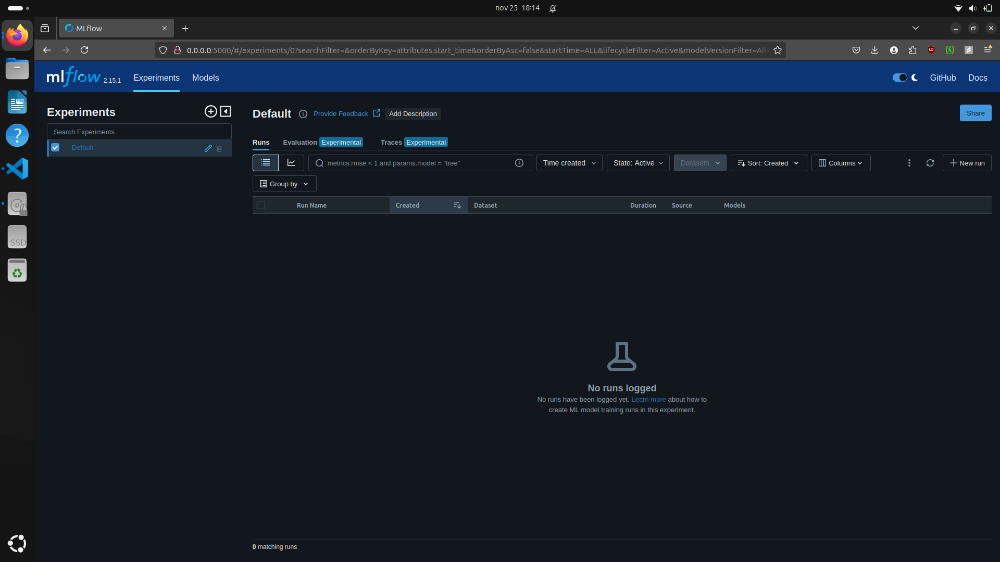

# End-to-end MLOps Project

<!-- TABLE OF CONTENTS -->
<details>
  <summary>Table of Contents</summary>
  <ol>
    <li>
      <a href="#about-the-project">About The Project</a>
      <ul>
        <li><a href="#structure">Structure</a></li>
        <li><a href="#pipelines">Pipelines</a></li>
        <li><a href="#built-with">Built With</a></li>
      </ul>
    </li>
    <li>
      <a href="#getting-started">Getting Started</a>
      <ul>
        <li><a href="#prerequisites">Prerequisites</a></li>
        <li><a href="#installation">Installation</a></li>
      </ul>
    </li>
    <li><a href="#workflow">Workflow</a></li>
    <li><a href="#roadmap">Roadmap</a></li>
    <li><a href="#contributing">Contributing</a></li>
    <li><a href="#license">License</a></li>
    <li><a href="#contact">Contact</a></li>
    <li><a href="#acknowledgments">Acknowledgments</a></li>
  </ol>
</details>

<!-- ABOUT THE PROJECT -->
## About The Project

The purpose of this project's design, development, and structure was to gain a deeper comprehension of the Machine Learning Operations (MLOps) lifecycle. Its goal was not to create the best machine learning system for determining an individual's level of obesity based on their physical characteristics and eating habits, but rather to replicate a real-world research setting in which data scientists write code in notebooks and then turn it into a complete ML pipeline solution by utilizing the fundamental ideas of MLOps.

<p align="right">(<a href="#readme-top">back to top</a>)</p>

### Structure

```bash
.
├── data
│   ├── Current_ObesityDataSet.csv
│   ├── download_data.sh
│   ├── Original_ObesityDataSet.csv
│   ├── Preprocessed_Original_ObesityDataSet.csv
│   └── README.md
├── docker-compose.yaml
├── LICENSE
├── models
│   ├── artifacts/
│   ├── features/
│   └── README.md
├── notebooks
│   ├── data_processing.ipynb
│   ├── dev_Dockerfile
│   ├── docs
│   │   ├── SETUP_AWS.md
│   │   └── SETUP_KAGGLE.md
│   ├── eda.ipynb
│   ├── experimentations.ipynb
│   ├── images/
│   ├── README.md
│   ├── requirements_dev.txt
│   └── VERSION
├── README.md
├── reports
│   ├── cov_html/
│   ├── data_drift.html
│   ├── data_quality.html
│   ├── model_performance.html
│   ├── README.md
│   └── target_drift.html
├── requirements.txt
├── Dockerfile
├── src
│   ├── api
│   │   ├── __init__.py
│   │   ├── main.py
│   │   └── utils.py
│   ├── config
│   │   ├── aws.py
│   │   ├── credentials.yaml
│   │   ├── __init__.py
│   │   ├── kaggle.py
│   │   ├── log.py
│   │   ├── logs.yaml
│   │   ├── metadata.yaml
│   │   ├── model.py
│   │   ├── model.yaml
│   │   ├── reports.py
│   │   ├── reports.yaml
│   │   ├── settings.py
│   │   └── settings.yaml
│   ├── data
│   │   ├── __init__.py
│   │   ├── processing.py
│   │   └── utils.py
│   ├── __init__.py
│   ├── model
│   │   ├── inference.py
│   │   └── __init__.py
│   ├── README.md
│   └── schema
│       ├── __init__.py
│       ├── monitoring.py
│       └── person.py
└── tests
    ├── __init__.py
    ├── integration
    │   ├── __init__.py
    │   ├── test_data_processing.py
    │   └── test_model_inference.py
    └── unit
        ├── __init__.py
        ├── test_api.py
        ├── test_data_functions.py
        ├── test_model_functions.py
        └── test_read_yaml_file.py
```

A brief explanation of the primary files and folders:

* `data`: where the script used to download both sets via Kaggle's API and the cleaned version of the training data as well as the evaluation and training datasets will be saved. Note: This folder is primarily used as a temporary folder to install the datasets and when the research environment is not operating locally.
* `models`: this is where the features (like training and validation arrays) and artifacts (like encoders and scalers) will be stored. Note: This folder is primarily used as a temporary location to install features and artifacts when the research environment is not operating locally.
* `notebooks`: these are used to simulate a real-life research work environment by conducting exploratory data analysis, data processing, model training and evaluation, and experiment tracking. Additionally, where the Docker file and isolated requirements for the development environment are stored.
* `reports`: this is where the coverage tests, model performance, data drift, data quality, and target drift monitoring tests will be stored.
* `src`: The main functions, including data processing, loading the trained model, model inference, configuration files, Pydantic's schemas, and the API code source.
* `tests`: this is where the model, data, and API unit and integration tests are created.
* `.pre-commit-config.yaml`: the configuration file for pre-commit.
* `.pylintrc`: the configuration file for Pylint.
* The file `docker-compose.yaml` is used to define and execute multi-container applications in both production and research settings. `Dockerfile`: the production environment's Dockerfile.
* `LICENSE`: the MIT license for the project.
* `requirements.txt`: the environment's requirements for production.

In-depth explanation of the files within the `src` folder:

* `api/`:
    * `main.py`: contains the pipeline and key functions of the API.
    * `utils.py`: contains auxiliary functions for the API, like generating monitoring reports and organizing data to precisely match Evidently AI's requirements.
* `config/`:
    * `aws.py`: handles the credentials for AWS specified in the credentials file.
    * `credentials.yaml`: credentials configuration file.
    * `kaggle.py`: deals with Kaggle's credentials defined inside the credentials file.
    * `log.py`: handles the logs setting specified in the configuration file.
    * `logs.yaml`: logs configuration file.
    * `metadata.yaml`: The metadata file for Cookiecutter.
    * `model.py`: handles the model setting specified in the configuration file.
    * `model.yaml`: model configuration file.
    * `reports.py`: handles the reports settings specified in the configuration file.
    * `reports.yaml`: reports configuration file.
    * `settings.py`: handles general setting specified in the configuration file.
    * `settings.yaml`: general settings configuration file.
* `data/`:
    * `processing.py`: the functions for processing the data, including loading a dataset, generating the desired features, scaling and encoding the features, and more,
    * `utils.py`: contains auxiliary functions for pre-processing and data processing tasks, like loading features and downloading datasets.
* `model/`:
    * `inference.py`: makes an inference for a given data set with the trained model.
* `schema/`:
    * `monitoring.py`: the Pydantic schema that verifies monitoring endpoint entries in the API.
    * `person.py`: the Pydantic schema used to verify the entries of the inference endpoint of the API.

<p align="right">(<a href="#readme-top">back to top</a>)</p>

### Pipelines

#### Research Environment


#### Production Environment


<p align="right">(<a href="#readme-top">back to top</a>)</p>

### Built With

* **API Framework**: FastAPI, Pydantic
* **Cloud Server**: AWS EC2
* **Containerization**: Docker, Docker Compose
* **Continuous Integration (CI) and Continuous Delivery (CD)**: GitHub Actions
* **Data Version Control**: AWS S3
* **Experiment Tracking**: MLflow, AWS RDS
* **Exploratory Data Analysis (EDA)**: Matplotlib, Seaborn
* **Feature and Artifact Store**: AWS S3
* **Feature Preprocessing**: Pandas, Numpy
* **Feature Selection**: Optuna
* **Hyperparameter Tuning**: Optuna
* **Logging**: Loguru
* **Model Registry**: MLflow
* **Monitoring**: Evidently AI
* **Programming Language**: Python 3
* **Project's Template**: Cookiecutter
* **Testing**: PyTest
* **Virtual Environment**: Conda Environment, Pip

<p align="right">(<a href="#readme-top">back to top</a>)</p>

<!-- GETTING STARTED -->
## Getting Started

This is an example of how you may give instructions on setting up your project locally.
To get a local copy up and running follow these simple example steps.

### Prerequisites

1. You must first have an AWS account (OPTIONAL) and a set of credentials for Kaggle's API before you can run the code.

2. Once you've obtained both, you must enter those credentials in the **settings.yaml** file, which is found in the **src/config** folder.

3. (OPTIONAL) You must use the research environment's documentation (**notebooks/docs**) to set up your AWS environment.

4. (OPTIONAL) Use the script included within the **data** folder to download both datasets (one for testing and the other for training and verifying the model). You can run that from your study environment as well.

5. Use the following command to install the pre-commit package manager:

```bash
pip install pre-commit
```

6. Activate pre-commit using the following command:

```bash
pre-commit install
```

### Installation

#### (RECOMMENDED) Using Docker-compose

1. To create and launch the research/dev and production environments, execute the following command:

```bash
docker-compose up -d
```

You should be able to see both the research environment (on port 8888) and MLflow (on port 5000). The figures below show an example of both environments running locally.




#### Using Conda Virtual Environments

1. Create a virtual environment for the research/dev environment using the following command:

```bash
conda create --name e2e-dev python=3.10 && conda activate e2e-dev
```

Then install the dependencies using the following command:

```bash
pip install notebooks/requirements_dev.txt
```

2. Create a virtual environment for the production environment using the following command:

```bash
conda create --name e2e-prod python=3.10 && conda activate e2e-prod
```

Then install the dependencies using the following command:

```bash
pip install requirements.txt
```

<p align="right">(<a href="#readme-top">back to top</a>)</p>

<!-- WORKFLOW -->
## Workflow

1. (OPTIONAL) Use the research environment to run the **Exploratory Data Analysis (EDA) notebook**. This notebook uses Seaborn and Matplotlib to better understand the original, raw dataset that will be used to train and assess the developed machine learning model (in this case, a LightGBM classifier).

2. Use the research environment to run the **Data Processing notebook**. Applying feature engineering, feature encoding, feature scaling, and separating the data into training and validation is the goal of this notebook. Pickle, Pandas, and Numpy are then used to save the artifacts and the cleaned features.

3. Use the research environment to run the **Model Experimentations notebook**. With feature selection and hyperparameter tuning using MLflow and Optuna, this notebook attempts to apply model experiments using a few different Machine Learning models (Random Forest, Decision Tree, XGBoost, LightGBM, and CatBoost). The MLflow model registry is used to store the best tuned models and baselines (using the model's default parameters). For further information, see the `README` file located within the `model` folder. The experiments (feature selection and hyperparameter tuning) and their best model (one for each experiment) saved locally in MLflow are both displayed in the figures below.


4. Use the production environment to run the **API**. For further information, see the `README` file located inside the `src` folder. An illustration of the API operating locally can be found in the figure below.


P.S. The root folder should be used to execute all commands from the research environment. The `src` folder is where the API should be executed.

<p align="right">(<a href="#readme-top">back to top</a>)</p>

<!-- ROADMAP -->
## Roadmap

- [ ] Add a model training endpoint.
- [ ] Add end-to-end test cases.
- [ ] Add a Continuous Delivery (CD) GitHub Action.
- [ ] Add Continuous Training (CT) workflow.
- [ ] Add a integration test case to assure that the model's performance showed in MLflow is the same when evaluating the model on the same data, but using the API's code.
- [ ] Integrate uvicorn to FastAPI.
- [ ] Fix the test GitHub's workflow (it's not finishing because needs connection with FastAPI and MLflow to validate some tests).
- [ ] Fix relative path issues in configuration files.
- [ ] Fix and improve Docker files.

<p align="right">(<a href="#readme-top">back to top</a>)</p>

<!-- CONTRIBUTING -->
## Contributing

Contributions are what make the open source community such an amazing place to learn, inspire, and create. Any contributions you make are **greatly appreciated**.

<p align="right">(<a href="#readme-top">back to top</a>)</p>

<!-- LICENSE -->
## License

Distributed under the MIT License. See `LICENSE` for more information.

<p align="right">(<a href="#readme-top">back to top</a>)</p>

<!-- CONTACT -->
## Contact

Rafael Greca Vieira - [GitHub](https://github.com/rafaelgreca) - [LinkedIn](https://www.linkedin.com/in/rafaelgreca/) - me@rgrecav.com

<p align="right">(<a href="#readme-top">back to top</a>)</p>
