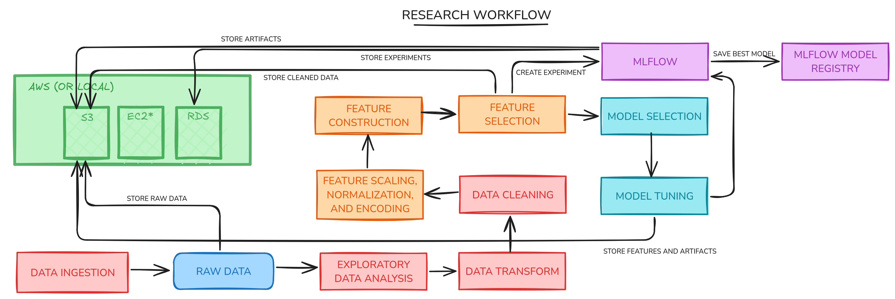
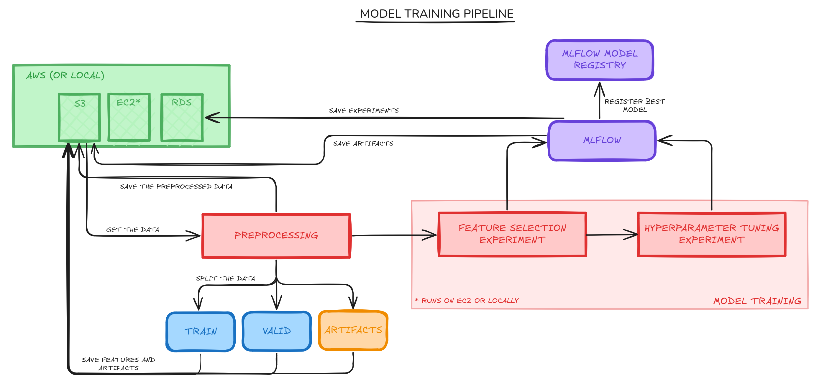
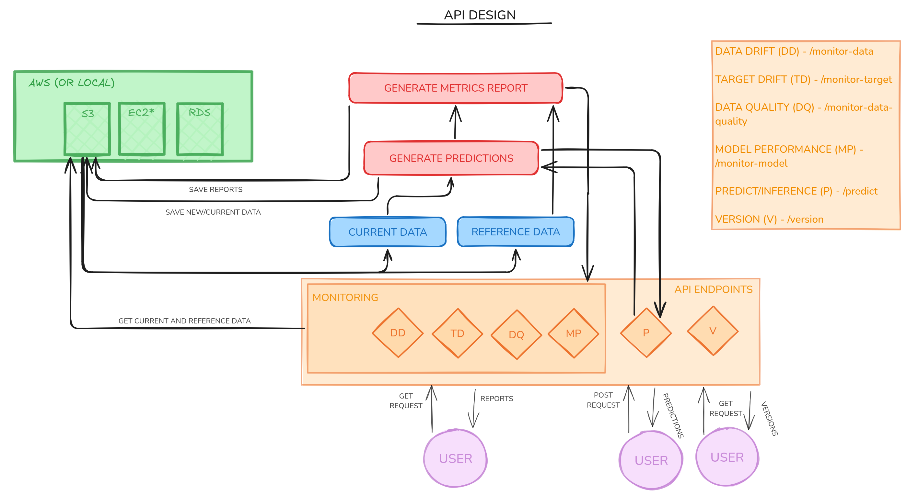
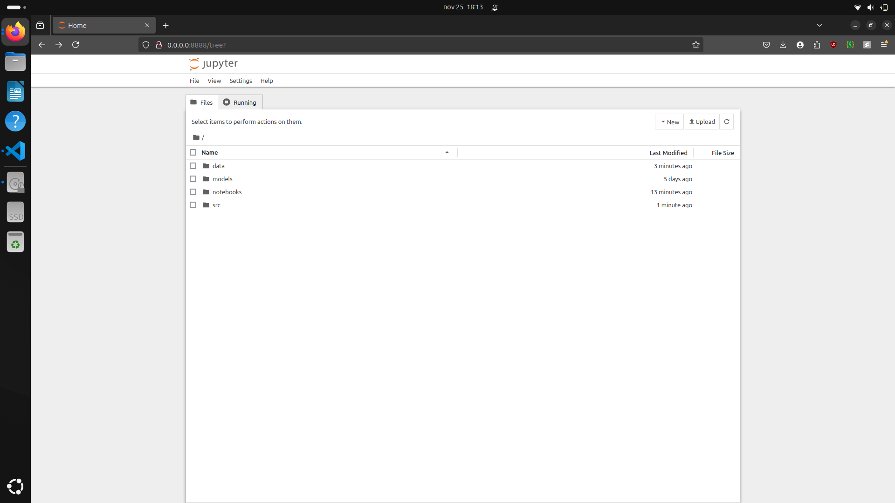
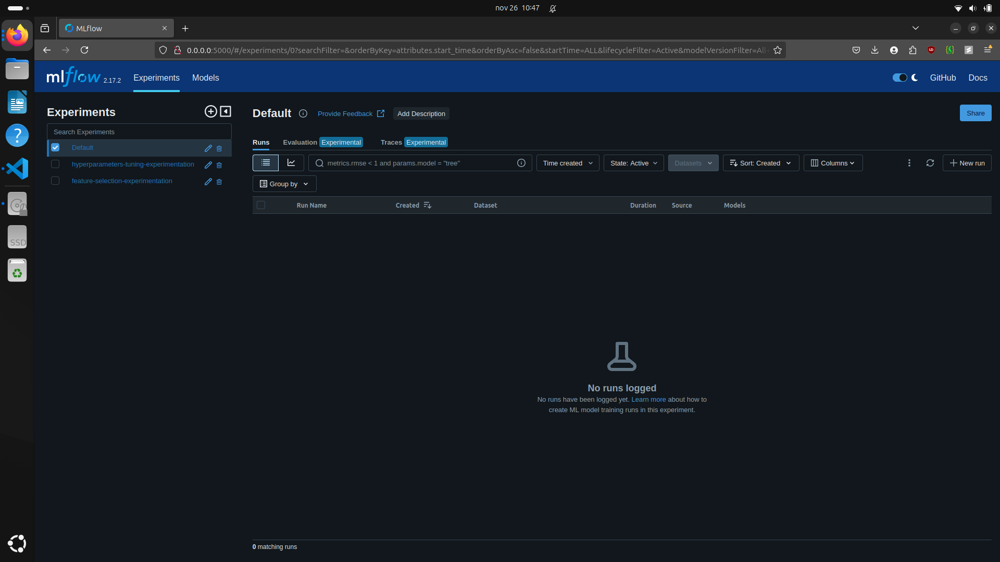
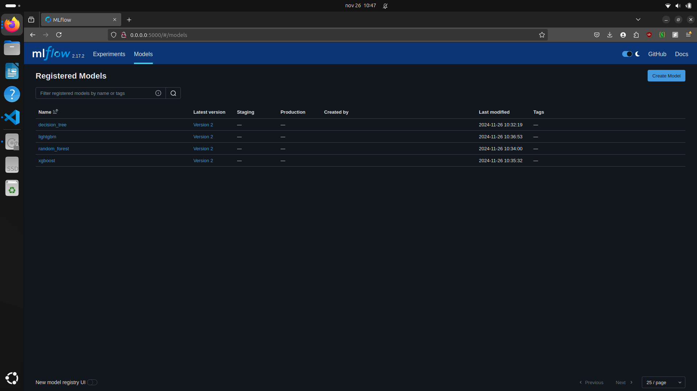
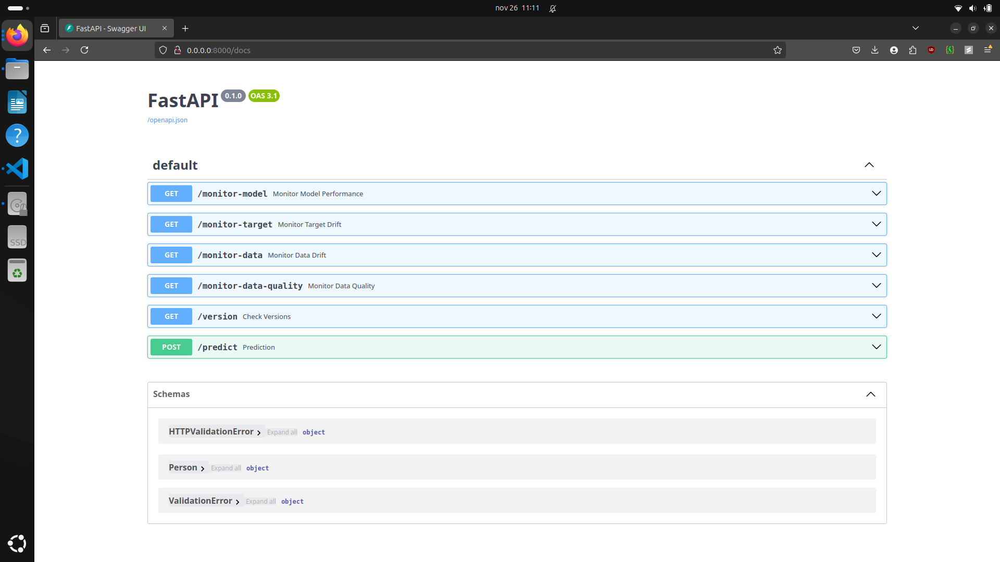
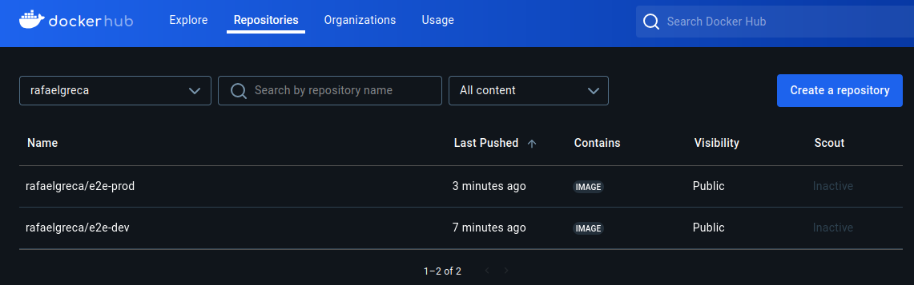

# End-to-end MLOps Project

<!-- TABLE OF CONTENTS -->
<details>
  <summary>Table of Contents</summary>
  <ol>
    <li>
      <a href="#about-the-project">About The Project</a>
      <ul>
        <li><a href="#structure">Structure</a></li>
        <li><a href="#pipelines">Pipelines</a></li>
        <li><a href="#built-with">Built With</a></li>
      </ul>
    </li>
    <li>
      <a href="#getting-started">Getting Started</a>
      <ul>
        <li><a href="#installation">Installation</a></li>
        <li><a href="#prerequisites">Prerequisites</a></li>
      </ul>
    </li>
    <li><a href="#usage">Usage</a></li>
    <li><a href="#roadmap">Roadmap</a></li>
    <li><a href="#contributing">Contributing</a></li>
    <li><a href="#license">License</a></li>
    <li><a href="#contact">Contact</a></li>
    <li><a href="#acknowledgments">Acknowledgments</a></li>
  </ol>
</details>

<!-- ABOUT THE PROJECT -->
## About The Project

The purpose of this project's design, development, and structure was to gain a deeper comprehension of the Machine Learning Operations (MLOps) lifecycle. Its goal was not to create the best machine learning system for determining an individual's level of obesity based on their physical characteristics and eating habits, but rather to replicate a real-world research setting in which data scientists write code in notebooks and then turn it into a complete ML pipeline solution by utilizing the fundamental ideas of MLOps.

<p align="right">(<a href="#readme-top">back to top</a>)</p>

### Structure

```bash
.
├── data
│   ├── Current_ObesityDataSet.csv
│   ├── download_data.sh
│   ├── Original_ObesityDataSet.csv
│   ├── Preprocessed_Original_ObesityDataSet.csv
│   └── README.md
├── docker-compose.yaml
├── LICENSE
├── models
│   ├── artifacts/
│   ├── features/
│   └── README.md
├── notebooks
│   ├── data_processing.ipynb
│   ├── dev_Dockerfile
│   ├── docs
│   │   ├── SETUP_AWS.md
│   │   └── SETUP_KAGGLE.md
│   ├── eda.ipynb
│   ├── experimentations.ipynb
│   ├── images/
│   ├── README.md
│   ├── requirements_dev.txt
│   └── VERSION
├── README.md
├── reports
│   ├── cov_html/
│   ├── data_drift.html
│   ├── data_quality.html
│   ├── model_performance.html
│   ├── README.md
│   └── target_drift.html
├── requirements.txt
├── Dockerfile
├── src
│   ├── api
│   │   ├── __init__.py
│   │   ├── main.py
│   │   └── utils.py
│   ├── config
│   │   ├── aws.py
│   │   ├── credentials.yaml
│   │   ├── __init__.py
│   │   ├── kaggle.py
│   │   ├── log.py
│   │   ├── logs.yaml
│   │   ├── metadata.yaml
│   │   ├── model.py
│   │   ├── model.yaml
│   │   ├── reports.py
│   │   ├── reports.yaml
│   │   ├── settings.py
│   │   └── settings.yaml
│   ├── data
│   │   ├── __init__.py
│   │   ├── processing.py
│   │   └── utils.py
│   ├── __init__.py
│   ├── model
│   │   ├── inference.py
│   │   └── __init__.py
│   ├── README.md
│   └── schema
│       ├── __init__.py
│       ├── monitoring.py
│       └── person.py
└── tests
    ├── __init__.py
    ├── integration
    │   ├── __init__.py
    │   ├── test_data_processing.py
    │   └── test_model_inference.py
    └── unit
        ├── __init__.py
        ├── test_api.py
        ├── test_data_functions.py
        ├── test_model_functions.py
        └── test_read_yaml_file.py
```

A brief explanation of the primary files and folders:

* `data`: where the script used to download both sets via Kaggle's API and the cleaned version of the training data as well as the evaluation and training datasets will be saved. Note: This folder is primarily used as a temporary folder to install the datasets and when the research environment is not operating locally.
* `models`: this is where the features (like training and validation arrays) and artifacts (like encoders and scalers) will be stored. Note: This folder is primarily used as a temporary location to install features and artifacts when the research environment is not operating locally.
* `notebooks`: these are used to simulate a real-life research work environment by conducting exploratory data analysis, data processing, model training and evaluation, and experiment tracking. Additionally, where the Docker file and isolated requirements for the development environment are stored.
* `reports`: this is where the coverage tests, model performance, data drift, data quality, and target drift monitoring tests will be stored.
* `src`: The main functions, including data processing, loading the trained model, model inference, configuration files, Pydantic's schemas, and the API code source.
* `tests`: this is where the model, data, and API unit and integration tests are created.
* `.pre-commit-config.yaml`: the configuration file for pre-commit.
* `.pylintrc`: the configuration file for Pylint.
* The file `docker-compose.yaml` is used to define and execute multi-container applications in both production and research settings. `Dockerfile`: the production environment's Dockerfile.
* `LICENSE`: the MIT license for the project.
* `requirements.txt`: the environment's requirements for production.

In-depth explanation of the files within the `src` folder:

* `api/`:
    * `main.py`: contains the pipeline and key functions of the API.
    * `utils.py`: contains auxiliary functions for the API, like generating monitoring reports and organizing data to precisely match Evidently AI's requirements.
* `config/`:
    * `aws.py`: handles the credentials for AWS specified in the credentials file.
    * `credentials.yaml`: credentials configuration file.
    * `kaggle.py`: deals with Kaggle's credentials defined inside the credentials file.
    * `log.py`: handles the logs setting specified in the configuration file.
    * `logs.yaml`: logs configuration file.
    * `metadata.yaml`: The metadata file for Cookiecutter.
    * `model.py`: handles the model setting specified in the configuration file.
    * `model.yaml`: model configuration file.
    * `reports.py`: handles the reports settings specified in the configuration file.
    * `reports.yaml`: reports configuration file.
    * `settings.py`: handles general setting specified in the configuration file.
    * `settings.yaml`: general settings configuration file.
* `data/`:
    * `processing.py`: the functions for processing the data, including loading a dataset, generating the desired features, scaling and encoding the features, and more,
    * `utils.py`: contains auxiliary functions for pre-processing and data processing tasks, like loading features and downloading datasets.
* `model/`:
    * `inference.py`: makes an inference for a given data set with the trained model.
* `schema/`:
    * `monitoring.py`: the Pydantic schema that verifies monitoring endpoint entries in the API.
    * `person.py`: the Pydantic schema used to verify the entries of the inference endpoint of the API.

<p align="right">(<a href="#readme-top">back to top</a>)</p>

### Pipelines

The research and production environments served as the foundation for this project. In addition to trying to improve the data quality by developing, designing, and testing new features and data cleaning procedures, the research environment seeks to create a space designed by Data Scientists to test, train, evaluate, and draw new experiments for new Machine Learning model candidates. This environment is entirely dependent on Jupyter Notebooks, which are not yet ready for production because they are very difficult to automate due to their manual dependency. Following the completion of all experiments in the research environment and the selection of the model to be used, the production environment was intended to be the next stage. In order to be more production-ready, the entire workflow—which only includes the steps that were used in the research environment—will be optimized and structured in this way to get around the drawbacks of the research environment, like its manual dependence and poor optimization, while also deploying the solution to the end-user.

#### Research Environment

As briefly introducted earlier, the research environment was designed to mimic a real-world scenario where Data Scientists conduct experiments for different steps throughout the Machine Learning Lifecycle workflow (e.g., model training and evaluation, data cleaning, feature construction and selection, and so on) using Jupyter Notebooks. The general overview of the research's workflow can be seen in the figure below.



First, a deep learning model trained on the [Obesity or CVD risk](https://www.kaggle.com/datasets/aravindpcoder/obesity-or-cvd-risk-classifyregressorcluster) dataset was used to create the [Multi-Class Prediction of Obesity Risk](https://www.kaggle.com/competitions/playground-series-s4e2) dataset, which was ingested using Kaggle's API and used to train and validate the models developed throught the pipeline. It is important to note that throughout the entire process, all datasets (raw and cleaned) and artifacts (such as scalers and encoders) were kept in an AWS S3 bucket (or locally within the `data` folder). In order to better understand the data and its characteristics and to learn what can be done in the next steps to improve the quality of the data, an Exploratory Data Analysis (EDA) is performed using the raw data.

Following the EDA step, a number of data and feature transformations are carried out, including data cleaning (deleting duplicate rows and dropping features that aren't useful), log transformation, height unit to centimeter conversion, numerical column to categorical transformation, standard scale application to the numerical columns, and one hot encoder to the target and categorical columns. Body Mass Index (BMI), Physical Activity Level (PAL), Body Surface Area (BSA), Ideal Body Weight (IBW), the difference between IBW and actual weight (DIFF_IBW), Basal Metabolic Rate (BMR), Total Daily Energy Expenditure (TDEE), Sufficient Water Consumption (SWC), Is Sedentary? (IS), Healthy Habits? (HH), Ideal Number of Main Meals? (INMM), and, lastly, Eat Vegetables Every Main Meal? (EVEMM) are some of the new features that are then manually constructed in the feature construction step.

Given that a range was established to retain at least 10% of the initial number of features and a maximum of 40%, experiments were created using MLflow and Sequential Feature Selector (SFS) to save the best feature combination. It's important to note that a few machine learning models, such as Decision Tree (DT), XGBoost, Random Forest (RF), LightGBM, and CatBoost, were used with their default parameters in order to assess that feature selection technique. Ultimately, each model has its own best feature combination, and the top model for each type (e.g., one for DT, one for RF, one for XGBoost, and so on) that produced the best outcome are kept in MLflow's model registry. The best models for each kind of model are then used in the hyperparameter tuning experiment, and they are also kept in MLflow's model registry. The figure below illustrates the model training pipeline used for both experiments (feature selection and model tuning) conducted using AWS EC2 (or locally), which divides the raw, preprocessed data into two sets: one for model training and another for performance validation.



It's important to emphasize that there is much space for improvement because the project's objective was not to place a strong emphasis on the research phase, but rather in the MLOps step (production environment).

#### Production Environment

Following the research phase, a production-ready solution is created using the best model, its required artifacts (such as scalers and encoders), the chosen features, and all necessary data processing steps. Software Engineering (SWE) best practices for code quality are used to create a new pipeline using the existing code developed in the research environment (note: we are not using all the features, so we are not using every step; we are not selecting features or training a new model).

The figure below shows the workflow for the production. The pipeline starts by loading the [Obesity or CVD risk](https://www.kaggle.com/datasets/aravindpcoder/obesity-or-cvd-risk-classifyregressorcluster) dataset, which we refer to as the "current" dataset, and the artifacts acquired during the model training in the research environment. In order to track target and data drift as well as the decline in the model's performance on the test set, this dataset was selected because it contains a variety of distributions for every feature that is available. The current data undergoes the same data transformation procedures as the training data. This also holds true for the feature selection and feature scaling processes (using the same artifacts). The selected model is loaded from the MLflow's model registry following preprocessing of the current data.

When everything is prepared, they can be used in the deployment process via an API made with FastAPI, or in the Continuous Integration (CI) and Continuous Delivery (CD) stages. During the CI/CD phase, Pylint will be used to test the code quality and unit and integration tests will be used to evaluate everything we have built. To ensure that everything is functioning and the model is attaining the performance indicated in MLflow, the trained model will also be evaluated and tested.


The figure below shows the design of the API if you decide to use it instead. Continuous Monitoring (CM) features, like detecting target or data drift, determining whether the model's performance is declining, and assessing the quality of the data, were built into the API. Generally speaking, the backend of the API will obtain the reference data (the data used to train the model) and the current data, compare the model's predictions on both, and compare the two datasets. Evidently AI is used to generate the monitoring reports, which are subsequently stored locally or in an AWS S3 bucket.



<p align="right">(<a href="#readme-top">back to top</a>)</p>

### Built With

* **API Framework**: FastAPI, Pydantic
* **Cloud Server**: AWS EC2
* **Containerization**: Docker, Docker Compose
* **Continuous Integration (CI) and Continuous Delivery (CD)**: GitHub Actions
* **Data Version Control**: AWS S3
* **Experiment Tracking**: MLflow, AWS RDS
* **Exploratory Data Analysis (EDA)**: Matplotlib, Seaborn
* **Feature and Artifact Store**: AWS S3
* **Feature Preprocessing**: Pandas, Numpy
* **Feature Selection**: Optuna
* **Hyperparameter Tuning**: Optuna
* **Logging**: Loguru
* **Model Registry**: MLflow
* **Monitoring**: Evidently AI
* **Programming Language**: Python 3
* **Project's Template**: Cookiecutter
* **Testing**: PyTest
* **Virtual Environment**: Conda Environment, Pip

<p align="right">(<a href="#readme-top">back to top</a>)</p>

<!-- GETTING STARTED -->
## Getting Started

This is an example of how you may give instructions on setting up your project locally.
To get a local copy up and running follow these simple example steps.

### Installation

To install this repository, first, you should clone the repository to the directory of your choice using the following command:

```bash
git clone https://github.com/rafaelgreca/e2e-mlops-project.git
cd e2e-mlops-project
```

P.S.: if you are interested in modifying the code as you desire, it's better to fork this repository and then clone your repository or create a new repository using this repository as a template.

### Prerequisites

1. You must first have an AWS account (OPTIONAL) and a set of credentials for Kaggle's API before you can run the code.

2. Once you've obtained both, you must enter those credentials in the **settings.yaml** file, which is found in the **src/config** folder.

3. (OPTIONAL) You must use the research environment's documentation (**notebooks/docs**) to set up your AWS environment.

4. (OPTIONAL) Use the script included within the **data** folder to download both datasets (one for testing and the other for training and verifying the model). You can run that from your study environment as well.

5. In order to save both Dockerfiles (for the development and production environments) in Docker Hub, you need to set up your `DOCKERHUB_USERNAME` and `DOCKERHUB_TOKEN` secrets in the repository's settings (`Settings > Secrets and Variables > Actions`).

6. Use the following command to install the pre-commit package manager:

```bash
pip install pre-commit
```

7. Activate pre-commit using the following command:

```bash
pre-commit install
```

<p align="right">(<a href="#readme-top">back to top</a>)</p>

<!-- Usage -->
## Usage

1. Go to the root folder of the project, then use Docker Compose to build the **dev** containers, which also includes the isolated environment for MLflow.

```bash
docker compose up -d --build dev mlflow
```

2. In your preferred browser, open the URL `http://0.0.0.0:8888/tree?`. The research environment, also known as the Jupyter notebooks, should appear, as shown in the figure below.



3. (OPTIONAL) Download both datasets (one for testing and one for training and model validation) using the `download_data.sh` script that comes with the **data** folder.

4. (OPTIONAL) Use the research environment to run the **Exploratory Data Analysis (EDA) notebook**. This notebook uses Seaborn and Matplotlib to better understand the original, raw dataset that will be used to train and assess the developed machine learning model (in this case, a LightGBM classifier).

5. Use the research environment to run the **Data Processing notebook**. Applying feature engineering, feature encoding, feature scaling, and separating the data into training and validation is the goal of this notebook. Pickle, Pandas, and Numpy are then used to save the artifacts and the cleaned features to the AWS S3 bucket or locally in the `models` folder.

6. Use the research environment to run the **Model Experimentations notebook**. With feature selection and hyperparameter tuning using MLflow and Optuna, this notebook attempts to apply model experiments using a few different Machine Learning models (Random Forest, Decision Tree, XGBoost, LightGBM, and CatBoost). The MLflow model registry is used to store the best tuned models and baselines (using the model's default parameters), while the AWS RDS is used as a backend store to save the experiments (or locally in the root folder inside `mlruns` and `mlartifacts` folders). For further information, see the `README` file located within the `model` folder. The experiments (feature selection and hyperparameter tuning) and their best model (one for each experiment) saved locally in MLflow are both displayed in the figures below.





7. The best models should be saved in MLflow's model registry after the experiments are finished, and you can then select one to deploy. The **experiment ID**, **run ID**, **name** (which you used to register the model), **version**, **flavor**, and, lastly, which **features** were used to train that model must all be obtained by opening the URL `http://0.0.0.0:8000/` in your preferred browser and placing them in the `src/config/model.yaml` file. In this case, we are using a `LightGBM` classifier model that was trained on with the following features: `['Gender_x0_Male', 'Age_x0_q3', 'Age_x0_q4', 'FAVC_x0_yes', 'CAEC_x0_Frequently', 'SCC_x0_yes', 'CALC_x0_no', 'EVEMM_x0_1', 'Height', 'Weight', 'FCVC', 'NCP', 'CH2O', 'FAF', 'TUE', 'BMI', 'PAL', 'IBW']`.

8. After navigating to the root folder of the project, use Docker Compose to build the **production** container by running the following command:

```bash
docker compose up -d --no-deps --build prod
```

9. The production environment, also known as the FastAPI documentation, should appear when you open the URL `http://0.0.0.0:5000/docs` in your preferred browser, as seen in the figure below.



10. The Fast API's user interface allows you to run the API by iterating directly. See the `README` file, which is contained in the `src` folder, for more details.

11. Go to the project's root folder, then use Docker Compose to create the **test** container with the following command to launch the unit and integration tests:

```bash
docker compose up -d --no-deps --build test
```

12. It should take a few seconds for the tests to complete. After that, you can run `docker logs <TEST_CONTAINER_ID>` to see the overall results or view the test coverage by looking at the `cov_html` folder inside the `reports` folder.

13. The docker's GitHub action/workflow will save both Dockerfiles (one for the develop/research environment and the other for the production environmet) images in your DockerHub's profile, as illustrated in the figure below.



DISCLAIMER: Just the workflow in the research environment was tested with AWS because of financial constraints. Docker Compose should be used to run everything locally in order to fully experience both research and production workflows.

<p align="right">(<a href="#readme-top">back to top</a>)</p>

<!-- ROADMAP -->
## Roadmap

- [ ] Add end-to-end test cases.
- [X] Add a Continuous Delivery (CD) GitHub Action.
- [ ] Add a integration test case to assure that the model's performance showed in MLflow is the same when evaluating the model on the same data, but using the API's code.
- [ ] Integrate uvicorn to FastAPI.
- [ ] Fix the test GitHub's workflow (it's not finishing because needs connection with FastAPI and MLflow to validate some tests).
- [X] Fix relative path issues in configuration files.
- [X] Fix and improve Docker files.

<p align="right">(<a href="#readme-top">back to top</a>)</p>

<!-- CONTRIBUTING -->
## Contributing

Contributions are what make the open source community such an amazing place to learn, inspire, and create. Any contributions you make are **greatly appreciated**.

<p align="right">(<a href="#readme-top">back to top</a>)</p>

<!-- LICENSE -->
## License

Distributed under the MIT License. See `LICENSE` for more information.

<p align="right">(<a href="#readme-top">back to top</a>)</p>

<!-- CONTACT -->
## Contact

Rafael Greca Vieira - [GitHub](https://github.com/rafaelgreca) - [LinkedIn](https://www.linkedin.com/in/rafaelgreca/) - me@rgrecav.com

<p align="right">(<a href="#readme-top">back to top</a>)</p>
